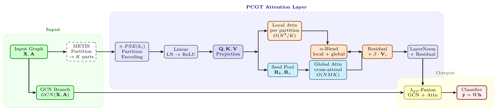
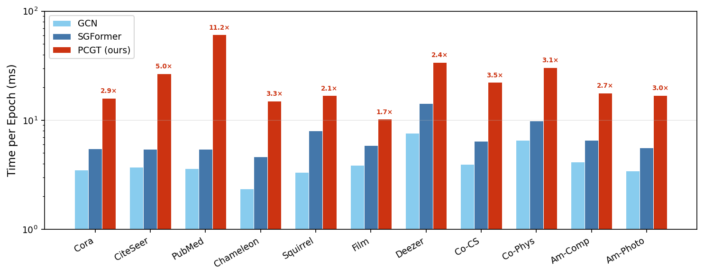
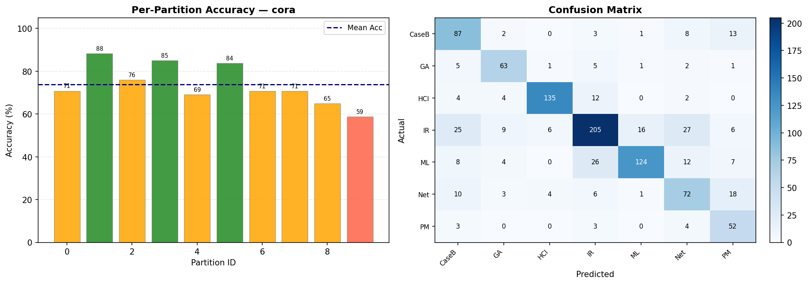
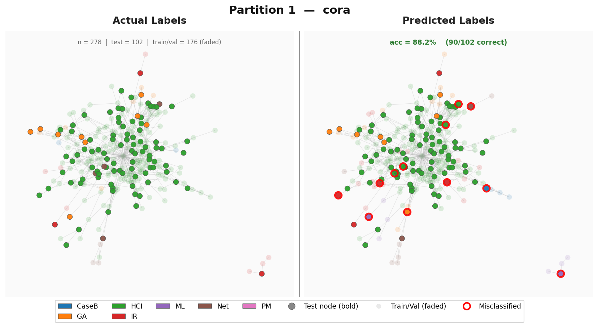
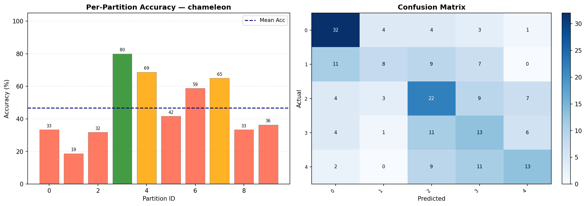
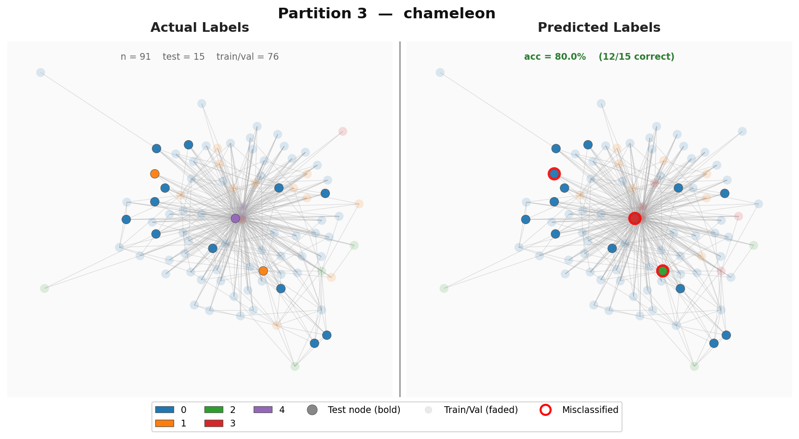

# PCGT: Partition-Conditioned Graph Transformer

A graph transformer that replaces expensive $O(N^2)$ global attention with **multi-resolution partition-aware attention**, achieving **linear complexity** while preserving structural awareness. PCGT computes exact attention within graph partitions and cross-partition attention via learned representative nodes.

Built upon and extending [SGFormer](https://arxiv.org/pdf/2306.10759.pdf) (NeurIPS 2023).

---

## Architecture

<p align="center">
  
</p>

The input graph is partitioned via METIS into $K$ groups. Each node receives a partition structural encoding (PSE), then Q/K/V projections feed two parallel branches: **local attention** within each partition ($O(N^2/K)$) and **global attention** via learned seed representatives ($O(NMK)$). The branches are $\alpha$-blended, augmented with a $\beta$-weighted self-connection, and fused with a GCN branch via the graph-weight $\lambda_{\text{gw}}$.

---

## Results

### Medium-Scale Node Classification (Accuracy %)

| Dataset | SGFormer | PCGT (ours) | $\Delta$ |
|---------|----------|-------------|---------|
| Cora | **84.50** ± 0.8 | 84.30 ± 0.4 | -0.20 |
| CiteSeer | 72.60 ± 0.2 | **73.10** ± 0.4 | +0.50 |
| PubMed | 80.30 ± 0.6 | **81.00** ± 0.6 | +0.70 |
| Film | 37.90 ± 1.1 | **38.00** ± 0.9 | +0.10 |
| Squirrel | 41.80 ± 2.2 | **45.50** ± 2.7 | +3.70 |
| Chameleon | 44.90 ± 3.9 | **49.00** ± 2.8 | +4.10 |
| Deezer | 67.10 ± 1.1 | **67.20** ± 0.7 | +0.10 |
| Coauthor-CS | 94.60 ± 0.5 | **95.10** ± 0.3 | +0.50 |
| Coauthor-Physics | 96.50 ± 0.2 | **96.80** ± 0.2 | +0.30 |
| Amazon-Computers | 87.20 ± 0.8 | **88.80** ± 0.7 | +1.60 |
| Amazon-Photo | 94.70 ± 0.4 | **95.30** ± 0.4 | +0.60 |

> PCGT wins on **10 out of 11** medium-scale benchmarks. Strongest gains on heterophilic graphs: Chameleon +4.10%, Squirrel +3.70%.

### Large-Scale Node Classification

| Dataset | Metric | SGFormer | PCGT (ours) |
|---------|--------|----------|-------------|
| ogbn-arxiv (169K) | Accuracy | 72.63 ± 0.13 | 72.36 ± 0.20 |
| ogbn-proteins (132K) | ROC-AUC | 79.53 ± 0.38 | **80.47** ± 0.55 |
| Pokec (1.6M) | Accuracy | 73.76 ± 0.24 | **76.68** ± 0.24 |

> On Pokec (1.6M nodes), PCGT outperforms SGFormer by **+2.92%**.

### Runtime Comparison (H100 GPU)

<p align="center">
  
</p>

---

## Partition Visualization

PCGT partitions the graph and performs local attention within each partition. Below are visualizations of the partition-level predictions on Cora and Chameleon.

### Cora — Per-Partition Accuracy & Confusion Matrix

<p align="center">
  
</p>

### Cora — Best Partition (88.2% accuracy, 90/102 correct)

<p align="center">
  
</p>

> Left: actual labels. Right: predicted labels. Red circles = misclassified nodes. Test nodes shown bold, train/val faded.

### Chameleon — Per-Partition Accuracy & Confusion Matrix

<p align="center">
  
</p>

### Chameleon — Best Partition (80.0% accuracy, 12/15 correct)

<p align="center">
  
</p>

> Chameleon is a heterophilic graph ($h=0.23$) where neighbors often have different labels — PCGT's partition-local attention handles this well.

---

## Repository Structure

```
PCGT/
├── medium/          # Medium-scale experiments (Cora, CiteSeer, PubMed, Chameleon, etc.)
│   ├── main.py      # Training & evaluation entry point
│   ├── pcgt.py      # PCGT model implementation
│   ├── sgformer.py  # SGFormer baseline (original code, method='sgformer')
│   ├── partition.py  # Graph partitioning utilities (METIS, spectral, random)
│   ├── run.sh       # Example run commands
│   └── results/     # Experiment result logs
├── large/           # Large-scale experiments (ogbn-arxiv, ogbn-proteins, Pokec)
│   ├── main.py      # Full-batch training
│   ├── main-batch.py # Mini-batch training for large graphs
│   ├── pcgt.py      # PCGT model (large-scale version)
│   ├── sgformer.py  # SGFormer baseline
│   └── run.sh       # Example run commands
├── 100M/            # ogbn-papers100M (SGFormer baseline only)
├── experiments/     # All experiment logs, results, and analysis scripts
│   ├── logs/        # Raw training logs from H100 GPU runs
│   ├── results/     # Parsed accuracy/timing results
│   ├── scripts/     # GPU run scripts, plotting, t-tests
│   └── MANIFEST.md  # Complete experiment documentation
├── data/            # Datasets (auto-downloaded or manual)
├── requirements.txt # Python dependencies
└── reproduce_paper_results.sh  # Commands to reproduce all results
```

## Requirements

```bash
pip install -r requirements.txt
```

Core dependencies:
- Python >= 3.10
- PyTorch >= 2.0.0
- PyTorch Geometric >= 2.3.0
- OGB >= 1.3.1
- pymetis (for METIS graph partitioning)

For GPU experiments (large-scale), install matching CUDA versions of torch-scatter, torch-sparse, torch-cluster:
```bash
pip install torch-scatter torch-sparse torch-cluster -f https://data.pyg.org/whl/torch-{TORCH_VERSION}+{CUDA_VERSION}.html
```

## Datasets

**Auto-downloaded**: OGB datasets (ogbn-arxiv, ogbn-proteins), PyG datasets (Cora, CiteSeer, PubMed, Coauthor-CS, Coauthor-Physics, Amazon-Computers, Amazon-Photo)

**Manual download**: Chameleon, Squirrel, Film, Deezer, Pokec — download from:
https://drive.google.com/drive/folders/1rr3kewCBUvIuVxA6MJ90wzQuF-NnCRtf?usp=drive_link

Or use the download script:
```bash
bash download_data.sh
```

For Chameleon and Squirrel, we use the [filtered splits](https://github.com/yandex-research/heterophilous-graphs/tree/main) that remove overlapping nodes.

## Running Experiments

### Method Names

| Method | Flag | Description |
|--------|------|-------------|
| SGFormer (baseline) | `--method sgformer` | Original SGFormer all-pair attention |
| PCGT (ours) | `--method pcgt` | Partition-conditioned graph transformer |

### Medium-Scale (Cora, CiteSeer, PubMed, Chameleon, Squirrel, Film, Deezer)

```bash
cd medium/

# SGFormer baseline on Cora
python main.py --method sgformer --dataset cora --backbone gcn \
    --lr 0.01 --num_layers 3 --hidden_channels 64 --weight_decay 5e-4 \
    --dropout 0.5 --ours_layers 1 --use_graph --graph_weight 0.8 \
    --ours_dropout 0.2 --use_residual --no_feat_norm \
    --seed 123 --runs 10 --epochs 500

# PCGT on Cora (K=10 partitions)
python main.py --method pcgt --dataset cora --backbone gcn \
    --lr 0.01 --num_layers 3 --hidden_channels 64 --weight_decay 5e-4 \
    --dropout 0.5 --ours_layers 1 --use_graph --graph_weight 0.8 \
    --ours_dropout 0.2 --use_residual --no_feat_norm \
    --num_partitions 10 --partition_method metis \
    --seed 123 --runs 10 --epochs 500
```

### Large-Scale (ogbn-arxiv, ogbn-proteins, Pokec)

```bash
cd large/

# SGFormer baseline on ogbn-arxiv
python main.py --method sgformer --dataset ogbn-arxiv --metric acc \
    --lr 0.001 --hidden_channels 256 --use_graph --graph_weight 0.5 \
    --gnn_num_layers 3 --trans_num_layers 1 \
    --seed 123 --runs 5 --epochs 1000 --eval_step 9

# PCGT on ogbn-arxiv (K=256 partitions)
python main.py --method pcgt --dataset ogbn-arxiv --metric acc \
    --lr 0.001 --hidden_channels 256 --use_graph --graph_weight 0.5 \
    --gnn_num_layers 3 --trans_num_layers 1 \
    --num_partitions 256 --partition_method metis \
    --seed 123 --runs 3 --epochs 1000 --eval_step 9

# For large graphs (proteins, pokec), use mini-batch training:
python main-batch.py --method pcgt --dataset ogbn-proteins --metric rocauc \
    --num_partitions 256 --batch_size 10000 \
    --seed 123 --runs 3 --epochs 1000 --eval_step 9
```

### PCGT-Specific Arguments

| Argument | Default | Description |
|----------|---------|-------------|
| `--num_partitions` | 10 (medium) / 100 (large) | Number of METIS graph partitions $K$ |
| `--partition_method` | `metis` | Partitioning algorithm (`metis`, `random`) |
| `--num_reps` | 4 | Number of representative nodes per partition (medium only) |
| `--no_pse` | False | Disable Partition Structural Encoding |
| `--local_only` | False | Ablation: only intra-partition attention |
| `--global_only` | False | Ablation: only cross-partition attention |

### Reproducing Paper Results

See `reproduce_paper_results.sh` for exact commands to reproduce all results, or run:
```bash
# Large-scale experiments (requires GPU)
cd large && bash run_all_large.sh pcgt
```

## Reproducing Results

All experiment logs and scripts are archived in `experiments/` for full reproducibility:

```
experiments/
├── logs/           # Raw training logs (H100 GPU, 3 rounds)
├── results/        # Parsed accuracy and timing results
├── scripts/        # GPU run scripts, t-test computation, plot generation
└── MANIFEST.md     # Complete experiment documentation with tables
```

**Quick reproduce**:
```bash
# 1. Setup
pip install -r requirements.txt
bash download_data.sh

# 2. Medium-scale (all 11 datasets, SGFormer + PCGT)
cd medium && bash run.sh

# 3. Large-scale (arxiv, proteins, pokec)
cd large && bash run.sh all

# 4. Regenerate plots
cd experiments/scripts
python generate_convergence_plot.py
python generate_runtime_plot.py
```

See `reproduce_paper_results.sh` for exact hyperparameters per dataset.

## Acknowledgements

This codebase is built upon [SGFormer](https://github.com/qitianwu/SGFormer) by Qitian Wu et al. (NeurIPS 2023). We thank the authors for their excellent open-source implementation.

```bibtex
@inproceedings{wu2023sgformer,
    title={SGFormer: Simplifying and Empowering Transformers for Large-Graph Representations},
    author={Qitian Wu and Wentao Zhao and Chenxiao Yang and Hengrui Zhang and Fan Nie and Haitian Jiang and Yatao Bian and Junchi Yan},
    booktitle={Advances in Neural Information Processing Systems (NeurIPS)},
    year={2023}
}
```

