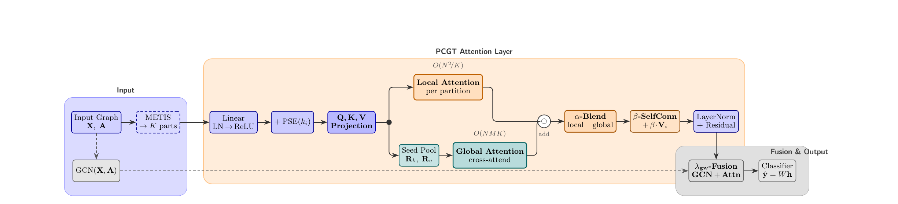
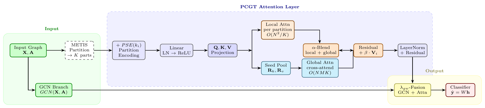
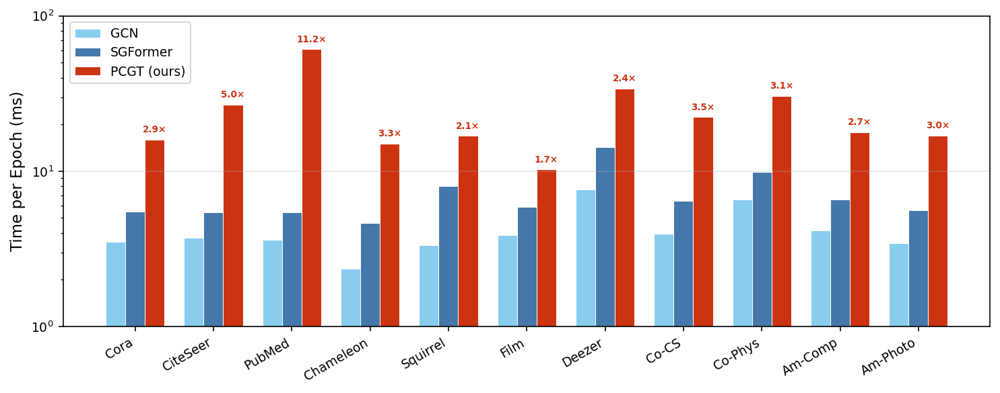
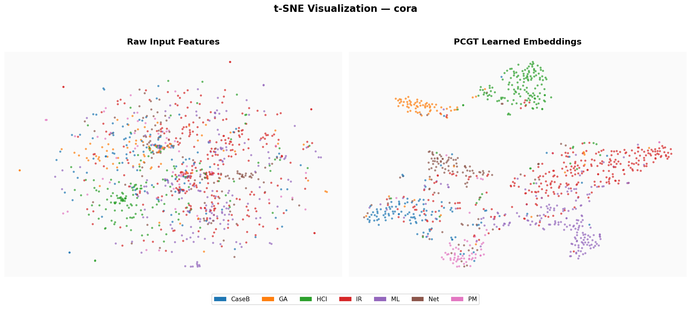
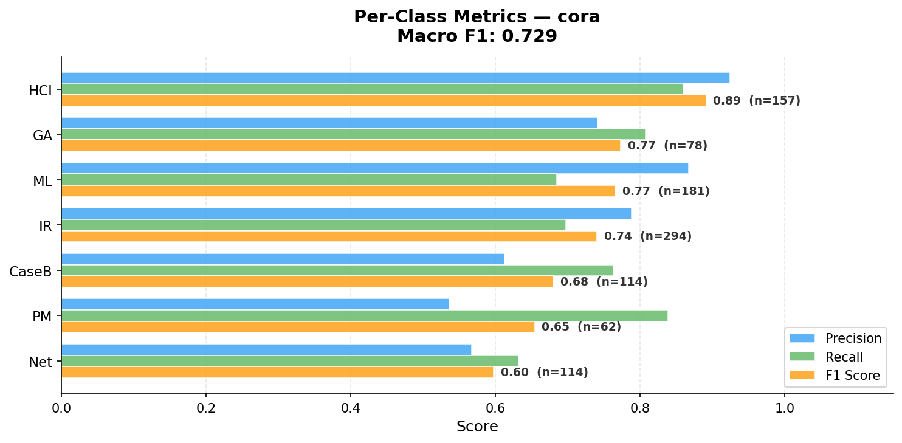
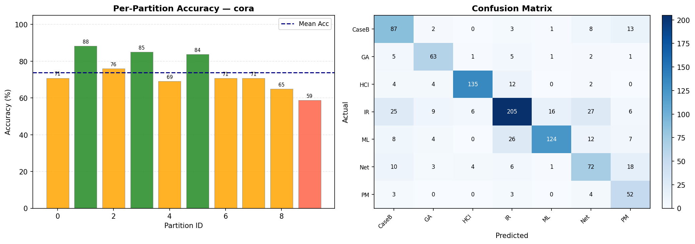
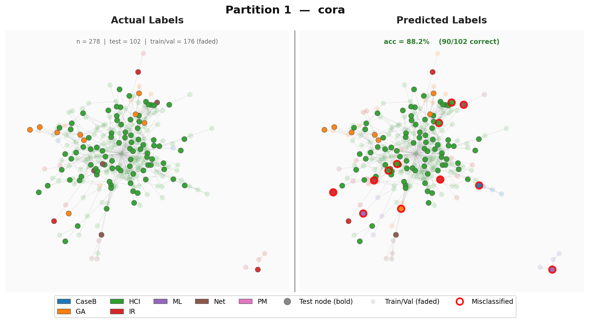
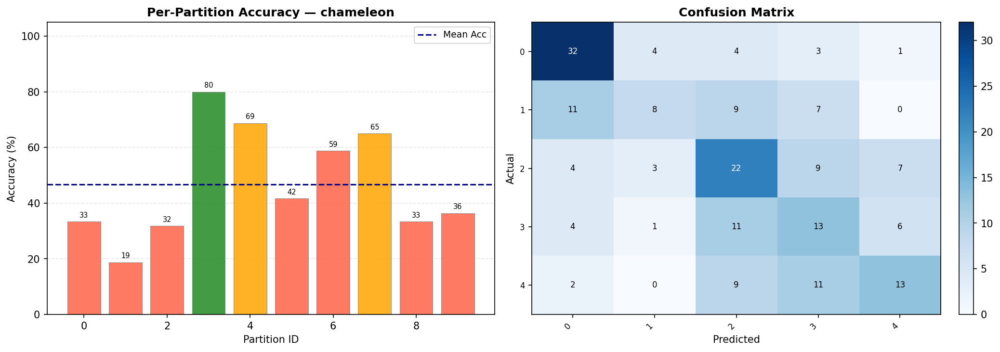
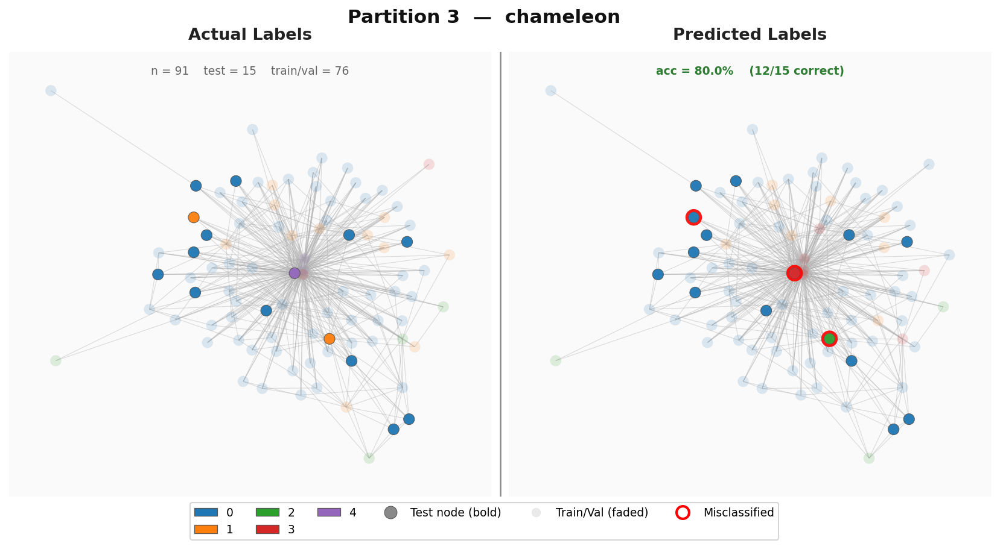

# PCGT: Partition-Conditioned Graph Transformer

<p align="center">
  
</p>

<p align="center">
  <b>PCGT</b> replaces expensive O(N²) global attention with <b>multi-resolution partition-aware attention</b>.<br>
  Local attention within partitions · Global attention via learned seeds · Subquadratic complexity O(N²/K + NMK)
</p>

<p align="center">
  <a href="#results">Results</a> •
  <a href="#visualizations">Visualizations</a> •
  <a href="#quick-start">Quick Start</a> •
  <a href="#running-experiments">Experiments</a> •
  <a href="#acknowledgements">Acknowledgements</a>
</p>

---

## How It Works

<p align="center">
  
</p>

1. **Partition** the graph into $K$ balanced groups using METIS
2. **Encode** each node with a learnable Partition Structural Encoding (PSE)
3. **Local attention** — exact softmax within each partition, $O(N^2/K)$
4. **Global attention** — cross-partition communication via $M$ learned seed vectors, $O(NMK)$
5. **Blend** local + global with learnable $\alpha$, add $\beta$-weighted self-connection
6. **Fuse** with a GCN branch via $\lambda_{\text{gw}}$ for the final prediction

Built upon [SGFormer](https://github.com/qitianwu/SGFormer) (Wu et al., NeurIPS 2023).

---

## Results

### Medium-Scale — 11 Benchmarks (Accuracy %)

| Dataset | SGFormer | **PCGT** | Δ |
|:--------|:--------:|:--------:|:-:|
| Cora | **84.50** ± 0.8 | 84.30 ± 0.8 | −0.20 |
| CiteSeer | 72.60 ± 0.2 | **73.10** ± 0.3 | **+0.50** |
| PubMed | 80.30 ± 0.6 | **80.90** ± 0.7 | **+0.60** |
| Film | **37.90** ± 1.1 | 37.70 ± 0.8 | −0.20 |
| Squirrel | 41.80 ± 2.2 | **45.60** ± 2.7 | **+3.80** |
| Chameleon | 44.90 ± 3.9 | **48.70** ± 3.2 | **+3.80** |
| Deezer | **67.10** ± 1.1 | 67.00 ± 0.6 | −0.10 |
| Coauthor-CS | 95.00 ± 0.5 | **95.00** ± 0.3 | +0.05 |
| Coauthor-Physics | 96.60 ± 0.2 | **96.80** ± 0.1 | **+0.15** |
| Amazon-Computers | 88.50 ± 1.6 | **89.00** ± 0.7 | **+0.57** |
| Amazon-Photo | 95.10 ± 0.8 | **95.50** ± 0.4 | **+0.38** |

> **PCGT wins 8/11 benchmarks.** Largest gains on heterophilic graphs: Chameleon **+3.80%**, Squirrel **+3.80%**.

### Large-Scale

| Dataset | SGFormer | **PCGT** | Δ |
|:--------|:--------:|:--------:|:-:|
| ogbn-arxiv (169K) | **72.63** ± 0.13 | 72.50 ± 0.14 | −0.13 |
| pokec (1.6M) | 73.76 ± 0.24 | **74.94** ± 0.28 | **+1.18** |
| Amazon2M (2.4M) | **89.09** ± 0.10 | 88.79 ± 0.06 | −0.30 |

> On **pokec (1.6M nodes)**, PCGT outperforms SGFormer by **+1.2%**.

### Runtime (H100 GPU)

<p align="center">
  
</p>

---

## Visualizations

### t-SNE Embeddings — Cora

<p align="center">
  
</p>

> t-SNE of raw features (left) vs PCGT learned embeddings (right) — PCGT produces well-separated clusters.

### Per-Class F1 Score — Cora

<p align="center">
  
</p>

### Partition-Level Analysis

<table>
<tr>
<td width="50%">

**Cora** (homophilic, $h=0.81$)



Best partition: **88.2%** accuracy (90/102 test nodes correct)


</td>
<td width="50%">

**Chameleon** (heterophilic, $h=0.23$)



Best partition: **80.0%** accuracy (12/15 test nodes correct)


</td>
</tr>
</table>

---

## Quick Start

> **Requires Python 3.10, 3.11, or 3.12.**

```bash
# Clone and setup
git clone https://github.com/ranjanchoubey/PCGT.git && cd PCGT
python3 -m venv venv && source venv/bin/activate
pip install -r requirements.txt

# Quick test — trains PCGT on Cora, expect ~84% accuracy
cd medium && python main.py --method pcgt --dataset cora --backbone gcn \
    --num_partitions 10 --seed 123 --runs 1 --epochs 500
```

For detailed installation (GPU setup, troubleshooting), see [SETUP.md](SETUP.md).

---

## Repository Structure

```
PCGT/
├── medium/                # Medium-scale experiments (11 datasets)
│   ├── main.py            # Entry point
│   ├── pcgt.py            # PCGT model
│   ├── sgformer.py        # SGFormer baseline model
│   ├── partition.py       # METIS graph partitioning
│   ├── models.py          # Other baseline models
│   └── run.sh             # Run all experiments
├── large/                 # Large-scale (arxiv, pokec, Amazon2M)
│   ├── main.py            # Full-batch training
│   └── main-batch.py      # Mini-batch for >100K nodes
├── 100M/                  # 100M-scale experiments
├── paper/                 # LaTeX source and PDF
├── visualization/         # Partition & analysis plots
├── assets/                # README images
├── data/                  # Datasets (auto-downloaded on first run)
├── reproduce_paper_results.sh  # Exact commands for all experiments
├── requirements.txt
└── SETUP.md               # Detailed setup & troubleshooting
```

## Requirements

- Python 3.10–3.12 · PyTorch ≥ 2.0 · PyTorch Geometric ≥ 2.3 · pymetis · OGB ≥ 1.3

```bash
pip install -r requirements.txt
```

For GPU: install matching CUDA versions of torch-scatter, torch-sparse from [PyG wheels](https://data.pyg.org/whl/).

## Datasets

**Auto-downloaded** (via PyTorch Geometric / OGB, no action needed):
Cora, CiteSeer, PubMed, Coauthor-CS, Coauthor-Physics, Amazon-Computers, Amazon-Photo, ogbn-arxiv.

**Pre-packaged in `data/`** (must be present before running — NOT auto-downloaded):
- **Chameleon** → `data/wiki_new/chameleon/chameleon_filtered.npz`
- **Squirrel** → `data/wiki_new/squirrel/squirrel_filtered.npz`
- **Film** → `data/geom-gcn/film/out1_graph_edges.txt`, `out1_node_feature_label.txt`, + 10 split files
- **Deezer** → `data/deezer/deezer-europe.mat`

These files use filtered splits from [Platonov et al. (2023)](https://arxiv.org/abs/2302.11640) and are included in the repository's `data/` directory (gitignored). If cloning fresh, download them:

```bash
# From a machine that has the data (e.g., your local copy):
tar czf missing_datasets.tar.gz data/wiki_new/ data/geom-gcn/film/ data/deezer/
# Then on the target machine:
tar xzf missing_datasets.tar.gz
```

**Manual download required:**
- **Pokec** (1.6M nodes): Download from [Google Drive](https://drive.google.com/drive/folders/1rr3kewCBUvIuVxA6MJ90wzQuF-NnCRtf?usp=drive_link) and place files (`pokec.mat`, `label.npy`, `node_feat.npy`) in `data/pokec/`
- **Amazon2M** (2.4M nodes): Auto-downloaded by OGB (`ogbn-products`)

---

## Running Experiments

### Method Flags

| Method | Flag | Description |
|--------|------|-------------|
| SGFormer (baseline) | `--method sgformer` | Original all-pair attention |
| **PCGT (ours)** | `--method pcgt` | Partition-conditioned attention |

### PCGT-Specific Arguments

| Argument | Default | Description |
|----------|---------|-------------|
| `--num_partitions` | 10 / 100 | Number of METIS partitions $K$ |
| `--partition_method` | `metis` | Partitioning algorithm |
| `--num_reps` | 4 | Seed vectors per partition $M$ |
| `--no_pse` | False | Disable Partition Structural Encoding |
| `--local_only` | False | Ablation: local attention only |
| `--global_only` | False | Ablation: global attention only |

### Examples

```bash
# Medium-scale
cd medium && python main.py --method pcgt --dataset cora --backbone gcn \
    --num_partitions 10 --seed 123 --runs 10 --epochs 500

# Large-scale (mini-batch)
cd large && python main-batch.py --method pcgt --dataset pokec \
    --num_partitions 500 --batch_size 100000 --runs 3 --epochs 1000
```

### Reproduce All Results

```bash
pip install -r requirements.txt
cd medium && bash run.sh          # All 11 medium-scale datasets
cd ../large && bash run.sh all    # arxiv, pokec, Amazon2M
```

See `reproduce_paper_results.sh` for exact per-dataset hyperparameters.

---

## Acknowledgements

Built upon [SGFormer](https://github.com/qitianwu/SGFormer) by Qitian Wu et al. (NeurIPS 2023).

```bibtex
@inproceedings{wu2023sgformer,
    title={SGFormer: Simplifying and Empowering Transformers for Large-Graph Representations},
    author={Qitian Wu and Wentao Zhao and Chenxiao Yang and Hengrui Zhang and Fan Nie and Haitian Jiang and Yatao Bian and Junchi Yan},
    booktitle={Advances in Neural Information Processing Systems (NeurIPS)},
    year={2023}
}
```

